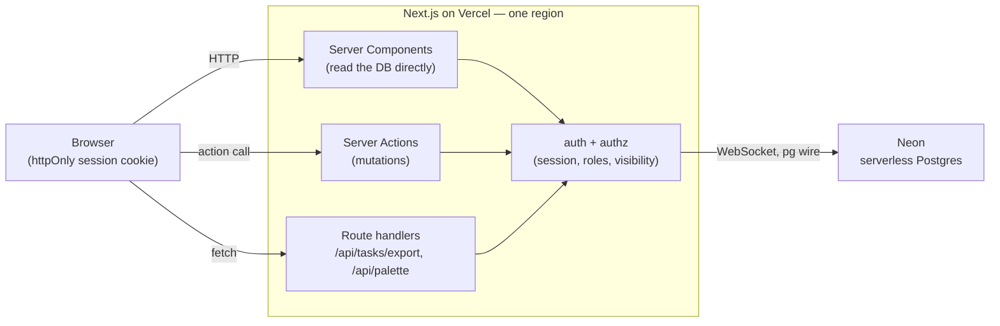
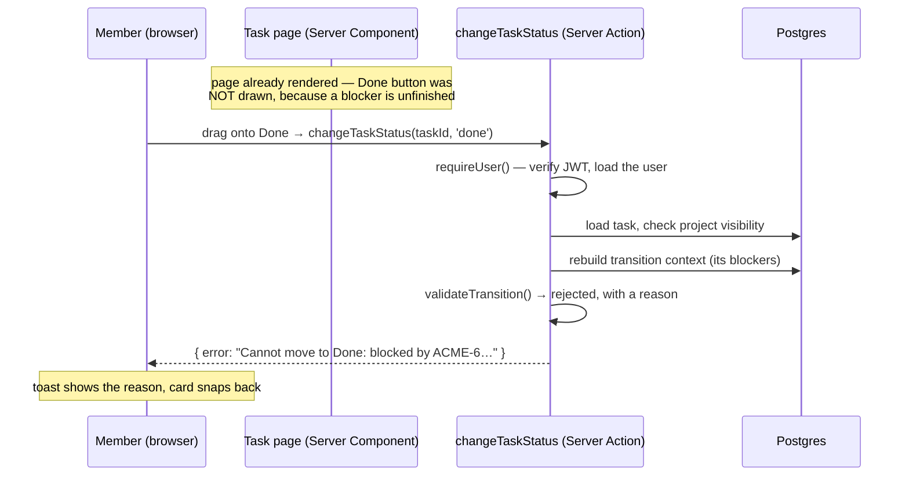

# Architecture

## The shape of it

One Next.js app, deployed as a single unit, talking to one Postgres database. There's no separate API
server and no client-side data layer. Pages are React Server Components that query the database
directly; changes go through Server Actions that run on the same server. The browser gets rendered
HTML plus a bit of JavaScript for the parts that are genuinely interactive.

That's the main architectural decision, and I'll defend it below under *Why one deployable unit*.

## The moving pieces, and where each one runs

| Piece | What it is | Where it runs |
|---|---|---|
| **Next.js app** | Pages, Server Actions, two route handlers | Vercel, Node runtime, one region |
| **Postgres** | All the state — users, projects, tasks, assignments, dependencies, the timeline, dismissals, time | Neon, same region as the app |
| **Drizzle** | Query builder + migrations. A library inside the app, not a service | in-process |
| **Session** | A signed JWT in an httpOnly cookie | issued by the app, held by the browser |
| **Browser JS** | Filters, bulk toolbar, the ⌘K palette, the board's drag-and-drop, the theme toggle | the viewer's browser |

That's the whole list. No queue, no cache layer, no background worker, no separate auth provider, no
websocket for live updates. I considered each and turned it down — see *What I decided not to build*.

Two details are worth calling out:

**The database driver is Neon's WebSocket pool, not its HTTP driver.** The HTTP one is simpler and
has a lower cold-start cost, but it can't hold an interactive transaction across statements. Almost
every mutation here is multi-statement — a status change writes the task row, its activity row, and
sometimes `completed_at`, and Goal 9 makes "a change without its timeline entry" a bug, not a
slightly-stale read. So they have to commit together. One extra dependency (`ws`) buys that.

**The session carries the user id and nothing that matters beyond it.** The role is re-read from the
database on every request rather than trusted from the token, so a manager who's demoted loses their
powers on the next request, not at token expiry.

---

## One request, end to end

I'll trace the path I'd want a reviewer to ask about: **a member drags a task to Done, and the
server refuses because something's still blocking it.** It touches authentication, authorisation, the
state machine, the timeline, and the interface's own idea of what's legal.

Step by step:

1. **Before the drag.** The page rendered on the server. It called `transitionContext(taskId)`,
   which loads the task and its unfinished blockers, and handed that to `allowedTransitions()` — a
   function that asks `validateTransition()` about every status and keeps the ones it accepts.
   Because this task has an unfinished blocker, **Done wasn't among them, so no Done button was drawn**
   in the first place, and the page prints the reason underneath. The interface can't offer a move
   the server would refuse, because both read the same function.

2. **The action fires.** A client component calls the `changeTaskStatus` Server Action inside a React
   transition. No `fetch`, no endpoint, no JSON — Next posts to the current route with an action id.

3. **Who's asking.** `requireUser()` reads the httpOnly cookie, verifies the JWT with `AUTH_SECRET`,
   and loads the user by id. No session, no user → redirect to `/login`. The actor is derived here
   and *never* from anything the request sent.

4. **May they.** `requireProjectAccess` checks visibility — managers see everything, members only
   their projects. A member poking at another project's task id gets the same "not found" as a task
   that doesn't exist, so ids can't be used to discover a project exists. Then a write-access check.

5. **Is it legal.** Inside a transaction, `applyStatusChange` rebuilds the transition context from the
   database — not from the client's idea of it — and calls the same `validateTransition`. On refusal
   it returns the reason and the transaction rolls back.

6. **The write** (when it *is* legal). One transaction: update `status`, set or clear
   `blocked_from_status`, set or clear `completed_at`, insert one `activity` row with the old and new
   value and who did it. Three check constraints make the inconsistent combinations impossible even
   if this code were wrong.

7. **Back to the browser.** `revalidatePath` marks the route stale, the action returns, Next
   re-renders on the server and streams it back. The buttons come back recomputed from the new state
   — the client never decided what the new legal moves were.

Same rules for one task or twenty: the bulk action calls `applyStatusChange` per task, so a batch
rejection reads exactly like a single one. And the drag-and-drop board goes through the very same
`changeTaskStatus`, which is why an illegal drag is refused with the same reason.

---

## Where the work happens, and why there

The rule throughout is **the server decides, the browser presents.**

| Concern | Where | Why there |
|---|---|---|
| Auth, authorisation, visibility | Server, every request | The brief wants it enforced on the server, not hidden in the UI. A hidden button is a courtesy; the refusal is the feature. |
| Search, filters, sort, pagination | SQL | The brief bans loading every task into the browser. Filters live in the URL, so the server gets them with the request and answers with one page plus a count. |
| Dashboard aggregates | SQL | Four headline numbers in one pass, not four scans or a `rows.filter().length`. |
| Transition rules | One shared module | Server imports it to reject, UI imports it to decide which buttons exist. Written twice, they'd drift. |
| Timeline writes | Same transaction as the change | A change without its history is a bug, not a stale read. |
| Filter chips, bulk selection, palette, board drag, theme | Browser | Genuinely interactive; a round trip per keystroke would be worse. |

Client components are the exception, not the default. Everything that can be a Server Component is
one.

---

## What I decided *not* to build

Each of these was a real option, and each got turned down for a reason rather than skipped.

- **A separate API server.** The brief suggests database / server / browser on three hosts. One
  Next.js app is fewer moving parts, one deployment, one place for authorisation, and no
  serialisation boundary to keep in sync. The cost is that the browser can't hit a public API — which
  nothing here needs. If a mobile client ever did, the query layer is already separated and would
  lift out behind route handlers.
- **A client-side data layer** (React Query, SWR, a store). Server Components already fetch on the
  server; a browser cache would mean two sources of truth for the same rows and a class of staleness
  bug the app currently can't have.
- **Row-level security in Postgres.** Tempting for Goal 1.5. Turned down because it needs a
  per-request role or a session variable on a pooled connection — fragile on serverless — and it
  moves the visibility rule out of the code a reviewer reads and into database config nobody's told
  about. It's one SQL predicate instead.
- **Database triggers for the timeline.** Harder to bypass, which is why I considered it for Goal
  9.6. But a trigger can't see *who* made the change without a session variable, and the goal needs
  the actor.
- **Full-text search.** Search is `ILIKE`, which no index serves. Instant at a few thousand tasks,
  and the first thing to break at scale — which `docs/schema.md` says plainly. Adding `pg_trgm` now
  would be an index nobody needs.
- **Real-time updates.** No websockets, no polling. Overdue work doesn't change second to second, and
  a refresh is an honest interaction here.
- **Email, password reset, OAuth, invitations.** Out of scope for the ten goals, and each drags in a
  provider and a delivery failure mode.
- **Optimistic UI on mutations, except the board.** Everywhere else, a mutation waits for the server,
  because the server is the arbiter of what's legal and showing a move as applied before it's
  accepted would be lying to the user — exactly what Goal 4 tests. The board is the one place I let
  it be optimistic, and even there it rolls back on rejection.

---

## Two things I'd change

**The command palette ships a task index.** It fetches up to 300 task titles on first ⌘K. The list
itself is genuinely server-paged, so Goal 6 is satisfied — but a reviewer would be right to ask why
one feature ships rows to the browser at all. The honest answer: matching locally responds within a
frame, and the cap is stated in the code. It's the wrong design past a few thousand tasks, at which
point it becomes a debounced server search.

**Week boundaries use the server's local time.** `todayISO()` was moved to an explicit
`BUSINESS_TIMEZONE` after I found the same data producing different overdue counts on my machine
(IST) and on Vercel (UTC). But "due this week" and the chart buckets still use server-local time. It
only shifts a boundary by hours and affects two soft figures rather than the hard overdue answer —
but it's inconsistent, and I'd finish the job.
