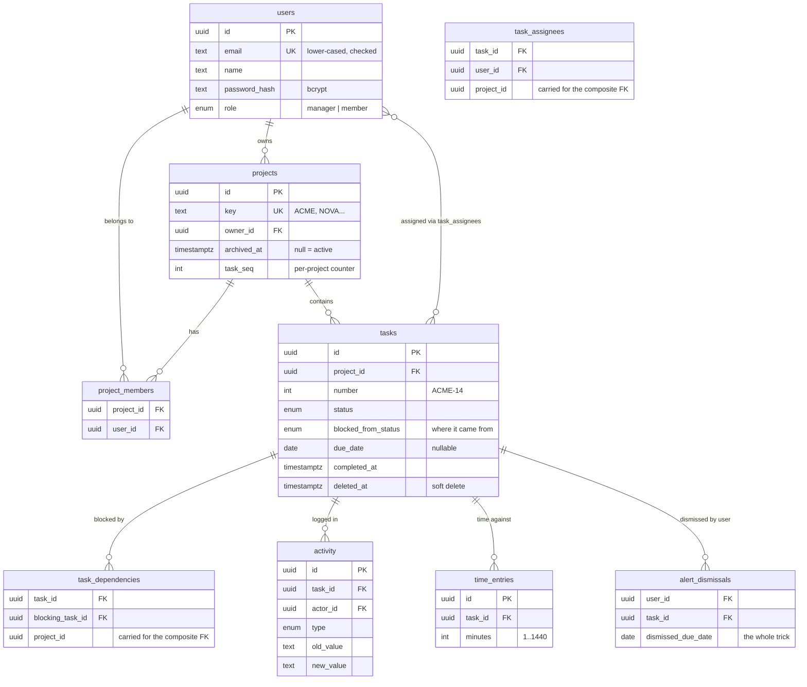
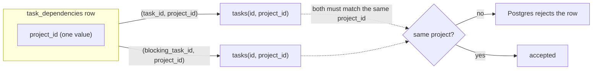

# Schema

Eight core tables plus one for time tracking, all in `public`, on Postgres 18 (Neon). The whole
thing lives in [`src/db/schema.ts`](../src/db/schema.ts) and the migrations that built it are
checked into [`drizzle/`](../drizzle).

If there's one idea behind all of this, it's: **let the database hold the rule wherever it can.** I
kept coming back to one question — *"could a second writer get this wrong?"* There's never just one
place that inserts a task. There's the normal form, the bulk action, the seed script, and whatever
gets added next month. A rule that only the normal form remembers isn't really a rule. So where
Postgres could enforce something, I made it.

Here's how the tables fit together before we go through them one by one:

---

## Table by table

### `users`

| Column | Type | Notes |
|---|---|---|
| `id` | `uuid` PK | `gen_random_uuid()` |
| `email` | `text` NOT NULL | unique; checked to be lower-cased |
| `name` | `text` NOT NULL | |
| `password_hash` | `text` NOT NULL | bcrypt, cost 12. The plaintext never leaves the handler |
| `role` | `user_role` NOT NULL | `manager` or `member`, defaults to `member` |
| `created_at` / `updated_at` | `timestamptz` NOT NULL | |

Roles are global, not per-project. The brief talks about managers as people who run the whole
portfolio, not people who happen to run one project — so "can this person archive a project" is a
field read, not a join. Nothing in the ten goals needed anything finer.

Emails are stored lower-cased and Postgres checks it, rather than the signup handler lower-casing and
everyone trusting it did. There's a second writer (the seed), and a case-varying duplicate would slip
straight past the unique index otherwise.

### `projects`

| Column | Type | Notes |
|---|---|---|
| `id` | `uuid` PK | |
| `key` | `text` NOT NULL | unique; must match `^[A-Z][A-Z0-9]{1,9}$` |
| `name` | `text` NOT NULL | |
| `description` | `text` NOT NULL | defaults to empty string, so readers never have to null-check |
| `owner_id` | `uuid` NOT NULL → `users.id` | `ON DELETE RESTRICT` |
| `archived_at` | `timestamptz` NULL | **null means active** |
| `task_seq` | `integer` NOT NULL | per-project task counter |
| `created_at` / `updated_at` | `timestamptz` NOT NULL | |

Archiving is a nullable timestamp, not a boolean and definitely not a delete. Default views filter on
`archived_at is null`, restoring just sets it back to null, and the value tells you *when* it was
archived — a boolean throws that away. No project row and no task row is ever destroyed.

`owner_id` is `RESTRICT` on purpose. A project must always have an owner, so trying to delete someone
who owns a dozen clients' projects should fail loudly and make you reassign them first, not silently
orphan the work.

`task_seq` is what gives you `ACME-14`. I could have used a single global sequence — simpler — but
task numbers are visible to anyone who opens the app, and a global counter leaks how much work exists
across every other client's project. Per-project keeps that quiet.

### `project_members` — join table

`(project_id, user_id)` primary key, plus a second index on `user_id` alone.

This little three-column table does more than it looks. It's the answer to Goal 1.5 (members only see
projects they're on), and it's the foreign-key *target* that lets two other tables enforce their
rules in the database. The PK handles "who's on this project"; the extra index on `user_id` handles
the reverse — "which projects is this person on" — which is the first thing every member-scoped query
asks.

### `tasks`

| Column | Type | Notes |
|---|---|---|
| `id` | `uuid` PK | |
| `project_id` | `uuid` NOT NULL → `projects.id` | exactly one project, per Goal 3.1 |
| `number` | `integer` NOT NULL | unique with `project_id` |
| `title` / `description` | `text` NOT NULL | |
| `status` | `task_status` | `backlog`, `in_progress`, `in_review`, `blocked`, `done` |
| `blocked_from_status` | `task_status` NULL | see below |
| `priority` | `task_priority` | `low`, `medium`, `high`, `urgent` |
| `due_date` | `date` NULL | optional — Goal 3.2 |
| `completed_at` | `timestamptz` NULL | see below |
| `deleted_at` | `timestamptz` NULL | soft delete |
| `created_by_id` | `uuid` NULL | |
| `created_at` / `updated_at` | `timestamptz` NOT NULL | |

A few choices worth explaining.

`due_date` is a `date`, not a timestamp. "Past its due date" is a calendar question — a timestamp
would drag in a time of day nobody means and make "overdue" depend on the viewer's timezone at
midnight.

The enums are real Postgres enums, not text. Two reasons: bad data can't exist even if a bug ships,
and Postgres orders enums by declaration order — so declaring priority `low → urgent` gives you Goal
6.7's "sort by priority" for free. Text would've needed a `CASE` in every sort.

Then three check constraints, and each earns its place:

| Constraint | What it guarantees |
|---|---|
| `(status = 'blocked') = (blocked_from_status is not null)` | Goal 4.3. You can't write a Blocked task with nowhere to return to, and you can't leave stale return-state on a task that isn't blocked any more. |
| `blocked_from_status in ('in_progress','in_review')` (or null) | Goal 4.2 — Blocked is only reachable from those two, so the memory of where it came from can only be one of them. |
| `(status = 'done') = (completed_at is not null)` | Keeps the denormalised `completed_at` honest. |

### `task_dependencies` — the clever one

Many-to-many, tasks to tasks. `task_id` is the blocked task, `blocking_task_id` is the blocker, and
`project_id` is carried **redundantly on purpose**.

Here's why. Goal 3.4 says a blocker has to be in the same project. The obvious way is to look up the
other task and compare project ids in application code. But then every call site has to remember to
do it. Instead, the row carries one `project_id`, and two composite foreign keys — both pointing at
`tasks (id, project_id)` — have to be satisfied by that single value:

There's no value you can put in that column that makes both FKs happy unless both tasks really are in
the same project. It's not a validation — it's an impossibility. Plus a `task_id <> blocking_task_id`
check so a task can't block itself.

### `task_assignees` — the same trick, one better

Many-to-many, tasks to users. Same redundant `project_id`, but here the two composite FKs point at
*different* tables:

- `(task_id, project_id) → tasks(id, project_id)`
- `(project_id, user_id) → project_members(project_id, user_id)`, `ON DELETE CASCADE`

That second one buys two goals at once. **Goal 5.2** — you can't be assigned unless you're a member,
because the FK into `project_members` can't be satisfied otherwise. **Goal 5.3** — remove someone
from a project and the cascade deletes exactly the assignments they held *on that project*, leaving
their work everywhere else alone. The scoping just falls out of the composite key.

(The app still does the unassignment explicitly in a transaction, because a cascade writes no
timeline rows and Goal 9.4 needs them. The FK is the floor, not the mechanism. More on that below.)

### `activity` — the timeline

One append-only stream per task. Columns for the actor, the type (`created`, `field_changed`,
`assigned`, `unassigned`, `commented`, `dependency_added/removed`), the old and new values as text,
a subject user for assignments, and a comment body. Index on `(task_id, created_at)` — the only way
it's ever read is "this task, in order".

Comments live in *this* table, not a separate one, because Goal 9.5 says comments are part of the
timeline. One table, one `ORDER BY created_at`, and there's no chance of two streams disagreeing about
order.

There's deliberately no `updated_at` here, and that's the point — see the constraints section.

### `alert_dismissals`

`(user_id, task_id)` primary key. The interesting column is `dismissed_due_date`, and it's the whole
design. An alert stays hidden for a person only while `dismissed_due_date = tasks.due_date`. Change
the date from anywhere and the dismissal stops matching — the alert comes back on its own, no cleanup
job, no flag to remember to clear. It even gets the changed-and-changed-back case right, which a
boolean wouldn't.

### `time_entries` — the stretch feature

One row per logged stretch of work: minutes, the day it was done, an optional note. Kept completely
separate from the eight core tables on purpose — a task's total time is the *sum* of its entries,
never a mutable column two writers could disagree about. A check constraint bounds each entry to
1–1440 minutes so a fat-fingered "600" meant as 60 can't quietly land as ten hours. The whole feature
could be dropped by deleting this one table.

---

## One-to-many vs many-to-many

**One-to-many:**
- users → projects (as owner)
- projects → tasks
- tasks → activity, tasks → time_entries
- users → activity (as actor)

**Many-to-many**, each with its own join table:
- users ↔ projects, via `project_members`
- users ↔ tasks, via `task_assignees`
- tasks ↔ tasks, via `task_dependencies` — a self-referencing one

**Roughly one-to-one:** `alert_dismissals` is at most one row per `(user, task)`.

---

## Which constraints live in the database, and which in the app

The dividing line is that same question: *could a second writer get this wrong?*

**In Postgres** — anything that's a property of the data itself:
- every foreign key and cascade
- both composite FKs (same-project dependencies; assignment implies membership)
- the three `tasks` checks, the time-entry bound
- format checks (project key, email lower-casing)
- uniqueness (email, project key, `(project_id, number)`)

I proved these actually fire by trying every illegal write against the real database and confirming
it refused — 20 cases now, all rejected. A constraint you've never watched fail isn't really a
constraint.

**In the app** — anything that needs context the row doesn't have:
- **The transition table.** Whether a move is legal depends on the current status, on
  `blocked_from_status`, and on *other rows* (Goal 4.5: no Done while a blocker's unfinished). A
  check constraint sees one row; it can't see a task's blockers. So this lives in one module,
  `src/lib/task-status.ts`, imported by both the server and the UI so they can't drift.
- **Role and visibility.** These depend on the session, which the database doesn't have. I looked at
  Postgres row-level security and passed — it needs a per-request role or a session variable on a
  pooled connection, which is fragile on serverless, and it hides the rule from the code a reviewer
  reads.
- **Writing the timeline.** A trigger could do it and be harder to bypass, but a trigger can't see
  *who* made the change without smuggling the actor through a session variable, and Goal 9.3 needs
  the actor.

**The honest gap.** Goal 9.6 says nothing in the timeline can be edited or deleted, *including by
managers*. Right now that's true by construction — the `activity` table has no `updated_at`, and
there's no update or delete path for those rows anywhere in the app. But it's not enforced by
Postgres. Anyone with the connection string could still rewrite a row by hand. Closing that properly
means a `BEFORE UPDATE OR DELETE` trigger that raises, plus revoking those grants from the app's role
— which needs a second, more privileged migration role that Neon's free tier makes awkward. It's a
real limitation and I'd rather write it down than pretend it isn't there.

---

## What I deliberately denormalised

1. **`tasks.completed_at`** — you could derive it by scanning the timeline for the last change to
   `done`. It's there because Goal 8 wants "completed this week" and an eight-week chart, and both
   become one indexed range scan instead of an aggregate over the whole audit log. Guarded by the
   `(status='done') = (completed_at is not null)` check, because an unguarded denormalisation is just
   a bug waiting for a reopen that forgets to clear it.
2. **`tasks.blocked_from_status`** — derivable by scanning history backwards. Storing it keeps Goal
   4.3 a direct read instead of a log query that slows as history grows, and stops a business rule
   from being coupled to the exact shape of audit rows.
3. **`project_id` on the two join tables** — strictly redundant, reachable through `task_id`. It's
   there so the composite FKs can exist at all. Clearest trade in the schema: one duplicated `uuid`
   per row buys three goals as database guarantees.
4. **`projects.task_seq`** — a counter that could be `max(number)+1`. The counter is O(1) and,
   under the same transaction as the insert, gapless. The `max()` is a scan and it races.

---

## What breaks first at 100× the data

Call today's size ~12 projects, ~50 people, a few thousand tasks. 100× is ~1,200 projects, ~5,000
people, hundreds of thousands of tasks — and millions of activity rows, since history only grows.

In the order I expect them to go:

1. **The text search, first and by a mile.** Search over titles *and* descriptions is
   `ILIKE '%term%'`, which no B-tree can serve — it's a sequential scan over everything the viewer
   can see. Fine at a few thousand rows; it's the first thing to fall over. The fix is known and
   cheap: `pg_trgm` with a GIN index, or a `tsvector` column if I want ranking. I've deliberately not
   built it — at this size it'd be an index nobody needs, and knowing exactly which query dies first
   is worth more than pre-optimising.
2. **The `COUNT(*)` for the total match count.** Goal 6.8 wants the total, so that's the same scan
   run twice on the most-used screen. The usual fixes (planner estimate, or a "1,000+" cap) both
   change what the UI can honestly claim.
3. **`activity` outgrowing everything.** It's the only append-only table and takes several rows per
   mutation, so at 100× it's the largest table by an order of magnitude. Reads stay fine —
   `(task_id, created_at)` is exactly the access pattern — but total size, backups, and any future
   cross-project feed would want time-based partitioning.
4. **The dashboard's by-assignee breakdown.** A group-by over every task the viewer can see, with no
   time bound. For a manager who sees everything, that's a full scan on every dashboard load. It's
   also the exact query that answers "who is overloaded" — the whole reason the product exists — so
   it'd be the one I'd fix second, with a covering index or a refreshed materialised view.

What doesn't worry me: the joins. Every many-to-many path has an index in the direction it's actually
read, and the composite FKs mean the planner has real statistics on the columns that scope every
query.
